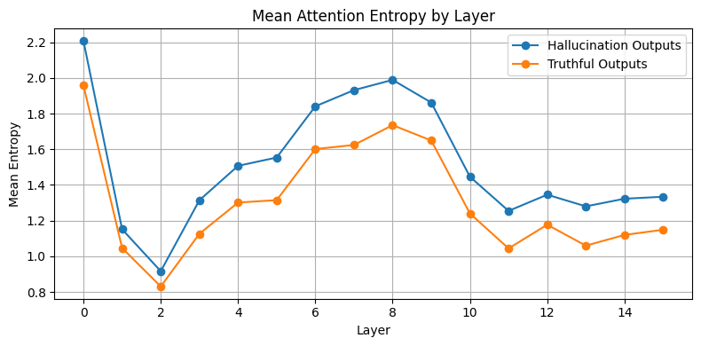
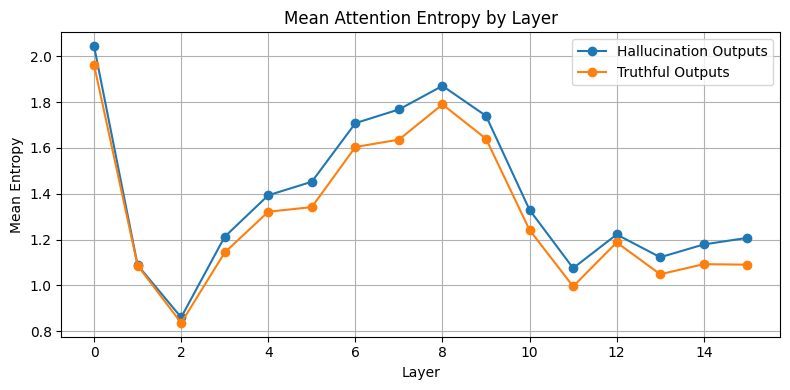
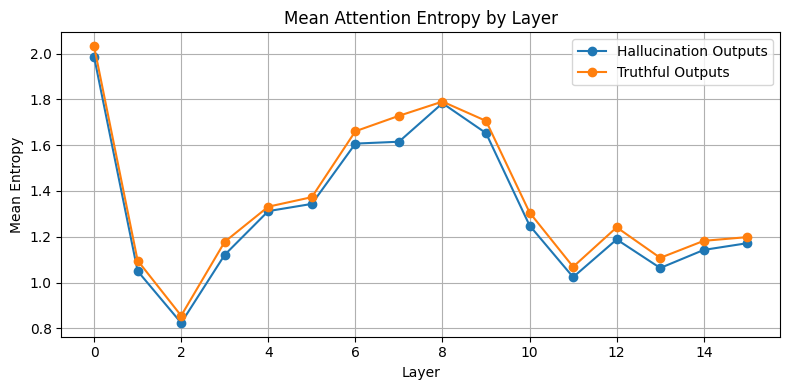
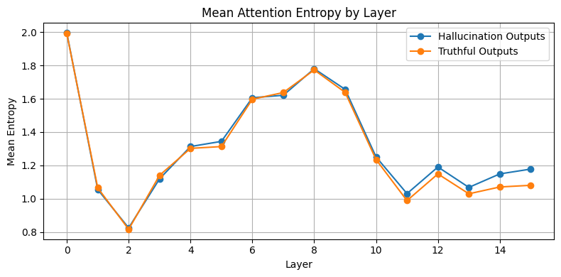

# Attention Entropy Patterns

This research project aims to identify the patterns of entropy and varentropy in attention weights, and their relation to model factuality, reasoning performance and hallucination rates.

This study is heavily inspired by [Entropix](https://github.com/xjdr-alt/entropix) project, which uses a special token sampling strategy based on entropy and varentropy of token probability distributions, which has shown promising results on reasoning.

This study aims to extrapolate this aproach deeper, into attention layers.

## Methodology

The study evaluates LLaMA 3.2 of sizes 1B, 3B, 11B (Vision), 90B (Vision)

### Truthfulness and Hallucination

The study will evaluate models on [SimpleQA](https://openai.com/index/introducing-simpleqa/) benchmark by OpenAI, record attention weights each run, and later study will compare entropy and varentropy patterns across non-hallucinated responses (Correct, Not Attempted) and hallucinated (Incorrect).

### Reasoning

The study will evaluate models on [GSM8K](https://huggingface.co/datasets/openai/gsm8k) dataset. Later, the models' wrong answers will be provided to GPT-4o to act as a critic, given problem, suggested solution and right solution, and critic will attempt to highlight the "moment where things went wrong" in model's CoT output, leading to wrong answer.

After that, entropy and varentropy patterns will be compared between corrent and incorrect answers, and also will be compared between wrong answer's "ordinary" tokens and "moment where things went wrong", to understand whether LLMs may have different entropy and varentropy patterns at "wrong" tokens compared to the rest of the answer.

Later, this may provide an opportunity to develop an instrument which would assign each token "confidence" score, helping to combat hallucination in LLMs.

## Pre-research

Here will be live translation of my findings.

### Initial exploration

Initial experiments with [meta-llama/Llama-3.2-1B-Instruct](https://huggingface.co/meta-llama/Llama-3.2-1B-Instruct) has yielded interesting patterns in ordinary text generation, yet, the study continues.


### Interesting results

It seems like if model is answering in a formal and factual manner -- average entropy across steps per layer tends to be lower than when model is tasked with something creative.

#### Example

```python
hallucination_messages = [
    {
        "role": "system",
        "content": "You are a helpful assistant! Answer shortly. Answer always in +- 10 words.",
    },
    {
        "role": "user",
        "content": "If your name was a fruit, what would it be? Be creative!",
    },
]

truthful_messages = [
    {
        "role": "system",
        "content": "You are a helpful assistant! Answer always in +- 10 words.",
    },
    {"role": "user", "content": "Mitosis is"},
]
```

```txt
I'd be a "Pomegranate" - rich, juicy, and full of hidden treasures inside.
The process of cell division resulting in two genetically identical daughter cells.

```

Note: This is CLEANED output, which does not include special tokens, input prompts, steps only related to output will be explored later but expected to have similar trend.



```python
hallucination_messages = [
    {
        "role": "system",
        "content": "You are a helpful assistant! Answer shortly. Answer always in +- 10 words.",
    },
    {
        "role": "user",
        "content": "How would you describe film about Star Wars and penguins?",
    },
]

truthful_messages = [
    {
        "role": "system",
        "content": "You are a helpful assistant! Answer always in +- 10 words.",
    },
    {"role": "user", "content": "Explain shortly what is European Union?"},
]

```

```txt
The film is a fantasy adventure combining Star Wars characters.
The European Union is a political and economic union.
```

Note: This is CLEANED output, which does not include special tokens, input prompts, steps only related to output will be explored later but expected to have similar trend.



Now, we compare two factual responses (do not look at variable name)

```python
hallucination_messages = [
    {
        "role": "system",
        "content": "You are a helpful assistant! Answer shortly. Answer always in +- 10 words.",
    },
    {
        "role": "user",
        "content": "Definition of mitosis",
    },
]

truthful_messages = [
    {
        "role": "system",
        "content": "You are a helpful assistant! Answer always in +- 10 words.",
    },
    {"role": "user", "content": "Definition of bill in U.S legal system"},
]
```

```txt
Mitosis is cell division process producing two identical daughter cells.
A bill in U.S. legal system is a written request for a law.
```



```python
hallucination_messages = [
    {
        "role": "system",
        "content": "You are a helpful assistant! Answer shortly. Answer always in +- 10 words.",
    },
    {
        "role": "user",
        "content": "Definition of mitosis",
    },
]

truthful_messages = [
    {
        "role": "system",
        "content": "You are a helpful assistant! Answer always in +- 10 words.",
    },
    {"role": "user", "content": "Who is Narendra Modi?"},
]
```

```txt
Mitosis is cell division process producing two genetically identical daughter cells.
Narendra Modi is the 14th Prime Minister of India.
```


